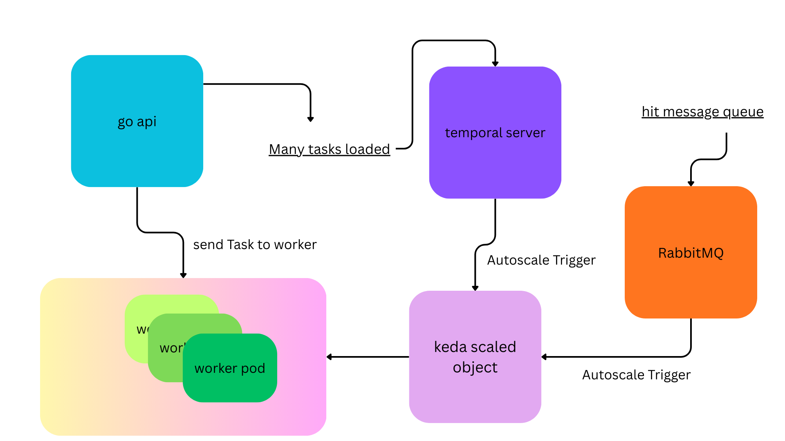

keda pod autoscaling for a worker pod written in golang 
pod can be any application


keda takes a trigger and scales the pod 

the triggers are 
temporal task queue lenght
rabbitmq message queue length


to start with rabbitmq trigger run hit_rabbitmq/main.go to send messages to rabbitmq 

for temporal queue length , it requires a lot of tasks in queue  with big timeouts at same time 



# Start Here
this can be achieved witrh task file 
or 
for individual steps 


## Prefer WSL for windows

read steps below 

### Install kind 
```bash
go install sigs.k8s.io/kind@v0.30.0
```


## initial setup

```bash
kind delete cluster --name keda-demo-cluster
kind create cluster --name keda-demo-cluster
kubectl create namespace keda-temporal
```

### install keda
```bash
helm repo add kedacore https://kedacore.github.io/charts
helm repo update
helm install keda kedacore/keda --namespace keda-temporal
```

### install rabbitmq
```bash
kubectl get pods -n keda-temporal
kubectl apply -f keda/rabbitmq.yaml
kubectl get pods -n keda-temporal
```

### install temporal
```bash
docker build -t temporal-dev:latest ./temporal
kind load docker-image temporal-dev:latest --name keda-demo-cluster
kubectl apply -f temporal/temporal-deployment.yaml
```

### install go api
```bash
docker build -t temporal-go-api:latest ./go-api
kind load docker-image temporal-go-api:latest --name keda-demo-cluster 
kubectl apply -f go-api/go-api-deployment.yaml
```

<!-- kubectl get pods -n keda-temporal

kubectl port-forward -n keda-temporal svc/temporal-go-api 8080:8080
#visit 
http://localhost:18080/health -->


<!-- worker   -->

### install worker
```bash
docker build -t temporal-worker:latest ./worker 
kind load docker-image temporal-worker:latest --name keda-demo-cluster 
kubectl rollout restart deployment temporal-worker -n keda-temporal
kubectl apply -f worker/worker-deployment.yaml
```

### check go api

```bash
kubectl get pods -n keda-temporal
kubectl port-forward -n keda-temporal svc/temporal-go-api 8080:8080
```


### apply autoscaling

```bash
kubectl apply -f keda/temporal-worker-scaledobject.yaml
```

### check autoscaling

```bash
kubectl port-forward -n keda-temporal svc/temporal-go-api 8080:8080
```


# visit 
http://localhost:8080/workers

```bash
kubectl port-forward -n keda-temporal svc/temporal-ui 30000:8233
```

### temporal ui
visit http://localhost:30000


```bash
 kubectl apply -f keda/temporal-worker-scaledobject.yaml
```


```bash
kubectl port-forward svc/temporal-go-api 8080:8080 -n keda-temporal
```

```bash
kubectl port-forward -n keda-temporal svc/my-rabbitmq 15672:15672
```

### To monitor temporal hpa when rabbitmq sends message 
```bash
kubectl get hpa -n keda-temporal -w  
```

### To trigger rabbitmq

```bash
go run hit_rabbitmq/main.go
```


### to trigger temporal

```bash
for     i in {1..1000}; do curl -X POST http://localhost:18080/tasks \
	  -H "Content-Type: application/json" \
	  -d '{"name":"alice"}'
done
```

---
# To Debug 


```bash
kubectl run debug-pod --rm -i --tty --image=alpine -- sh
```


visit http://localhost:30000

```bash
kubectl port-forward -n keda-temporal svc/temporal-metrics 30001:9100
```
visit http://localhost:30001/metrics


